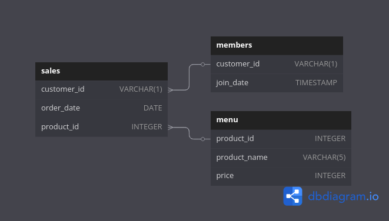
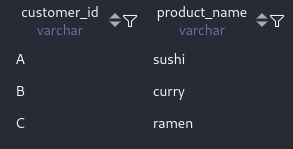
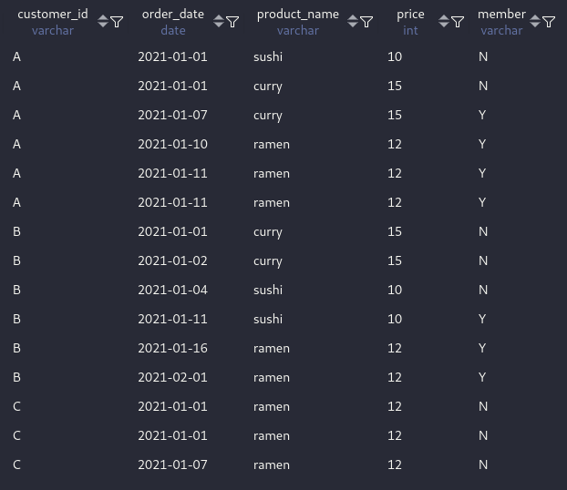

# Week 1 - Danny's Diner: SQL Challenge

## Description

This week, I tackled the Week 1 case study. The dataset models a Japanese restaurant's sales, menu items, and customer memberships. Using SQL, I answered various business questions to uncover customer behavior and trends. Key focus areas:
- Customer spending habits
- Menu item popularity
- Loyalty program effectiveness

[Case Study #1](https://8weeksqlchallenge.com/case-study-1/) | [My Solution Code](/week-1-dannys-diner/solutions-week-1.sql)

## Tables Overview

- `sales`: Customer purchases with `order_date` and `product_id`
- `menu`: Product details with `product_id`, `product_name`, and `price`
- `members`: Membership info with `customer_id` and `join_date`


*Relationship Diagram*

## Questions

1. What is the total amount each customer spent at the restaurant?
2. How many days has each customer visited the restaurant?
3. What was the first item from the menu purchased by each customer?
4. What is the most purchased item on the menu and how many times was it purchased by all customers?
5. Which item was the most popular for each customer?
6. Which item was purchased first by the customer after they became a member?
7. Which item was purchased just before the customer became a member?
8. What is the total items and amount spent for each member before they became a member?
9. If each \$1 spent equates to 10 points and sushi has a 2x multiplier – how many points would each customer have?
10. In the first week after joining (incl. join date), members earn 2x points on all items – how many points do A and B have by end of Jan?

## Key Concepts Used

- JOINs (`INNER`, `LEFT`)
- Aggregation (`COUNT`, `SUM`, `GROUP BY`)
- Window Functions (`ROW_NUMBER`, `RANK`)
- CTEs (Common Table Expressions)
- Date Filtering & Case Logic

## Example Query

Here is a few sample output.
- **Question 3 output and code snippet.**

Code Snippet:
```sql
with rank_cte as (select *, row_number() over(partition by customer_id order by order_date) as rnk
from sales)
select customer_id, product_name
from rank_cte s
join menu m on s.product_id = m.product_id
where rnk = 1;
```
  
*Using ROW_NUMBER() to identify first purchases*

- **Data Integration**: Created unified view of purchases with membership status flags

Code Snippet:
```sql
SELECT s.customer_id,order_date,product_name, price, 
CASE 
	WHEN join_date IS NULL THEN "N"
	ELSE  IF(order_date>=join_date,"Y","N")
END as `member`
FROM sales s
LEFT JOIN menu m 
	ON s.product_id = m.product_id
LEFT JOIN members n
	ON s.customer_id = n.customer_id;
```


## Key Insights
  
- Identified most frequent customers and their preferences
- Quantified the impact of the loyalty program on purchasing behavior
- Discovered menu items with highest customer engagement
